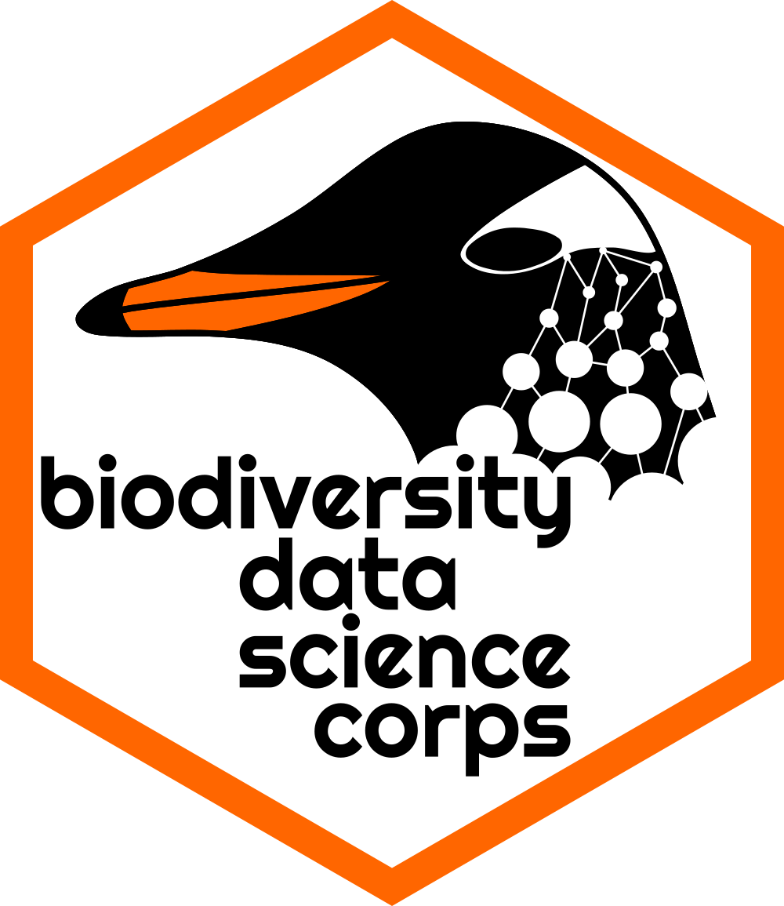

# Instructional Data Science Pedagogy

This site includes curricular material for the summer workshop series on 
designing data science modules for undergraduate classrooms. The funding for 
this work comes from the NSF-funded project "Building Capacity in Data 
Science through Biodiversity, Conservation, and General Education" (Awards 
[2122967](https://www.nsf.gov/awardsearch/showAward?AWD_ID=2122967) 
and [2122991](https://www.nsf.gov/awardsearch/showAward?AWD_ID=2122991)).

The first portion of the series is broken into three modules:

| Module | Lesson |
|:-------|:-------|
| 1: Upskilling | [Introductions](1-1-introductions.md) |
| | [Building skill](1-2-building-skill.md) |
| | [Memory & learning](1-3-memory-load.md) |
| 2: Learning goals & the environment | [Learning goals](2-1-learning-goals.md) | 
| | [Motiviation & demotivation](2-2-motivation.md) |
| | [Equity, inclusion, & accessibility](2-3-eia.md) |
| 3: The skill of teaching | [Feedback](3-1-feedback.md) | 
| | [The art of live coding](3-2-live-coding.md) |
| | [Practice live coding](3-3-practice.md) |
